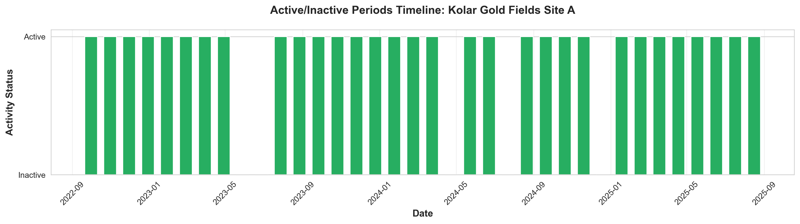

# MINING SITE INSPECTION REPORT

**Kolar Gold Fields Site A**  
Kolar District, Karnataka, India

---

## Report Metadata

| Field | Value |
|-------|-------|
| **Report Generated** | October 13, 2025 |
| **Mine ID** | MN-KA-2023-001 |
| **Operator** | ABC Mining Ltd |
| **Status** | Active |
| **Compliance** | Within Permitted Area ✓ |
| **Imagery Source** | Sentinel-2 (2025-09-10) |
| **Model Version** | v2.3.1 |

---

## EXECUTIVE SUMMARY

### Query
*"Provide comprehensive assessment of Kolar Gold Fields Site A including expansion trends, environmental compliance, and operational status"*

### Key Findings

**Site Status:** Currently **ACTIVE** with high detection confidence

#### Operational Metrics
- **Total Mining Area:** 45.3 hectares (90.6% of permitted 50.0 ha)
- **Excavation Depth:** Average 28.5m, Maximum 42.0m
- **Total Volume Extracted:** 1.29 million cubic meters
- **Last Survey:** 45 days ago

#### Compliance Status: ✓ SATISFACTORY

All operations are within permitted lease boundary with appropriate buffer zones:

- **Water bodies:** 2.3 km (Safe distance ✓)
- **Forest areas:** 1.5 km (Within limits ⚠)
- **Settlements:** 3.8 km (Adequate buffer ✓)

#### Environmental Impact

- **Vegetation loss:** ~80% in mining zone over 3 years
- **Bare soil increase:** ~73% indicating active excavation
- **Land cover change:** Accelerating in recent months

#### Priority Recommendations

1. Continue quarterly monitoring given active status
2. Conduct ground verification (last survey: 45 days ago)
3. Monitor proximity to forest boundary (1.5 km - recommend >2 km)
4. Track expansion rate vs district average (Currently: 8.5%/year)

---

## 1. SITE DETAILS & SPATIAL CHARACTERISTICS

### 1.1 Entity Information

| Category | Details | Category | Details |
|----------|---------|----------|---------|
| **Mine ID** | MN-KA-2023-001 | **Ownership** | Private |
| **Coordinates** | 13.1389°N, 78.2981°E | **Operator** | ABC Mining Ltd |
| **District** | Kolar | **State** | Karnataka |
| **Status** | Active | **Last Detection** | 2025-09-15 |

### 1.2 Spatial Characteristics

| Metric | Value | Status |
|--------|-------|--------|
| **Mining Area** | 45.3 ha | 90.6% of permitted area |
| **Perimeter Length** | 3,200 m | - |
| **Average Depth** | 28.5 m | Within limits |
| **Maximum Depth** | 42.0 m | 84% of 50m limit |
| **Estimated Volume** | 1,290,000 m³ | 1.29 million cubic meters |
| **Elevation Range** | 720 - 780 m | 60m variation |

*Figure 1.1: Comprehensive spatial statistics and measurements*

### 1.3 Proximity to Sensitive Zones

| Zone Type | Distance | Compliance Status | Risk Level |
|-----------|----------|-------------------|------------|
| **Water Body** | 2.3 km | ✓ Safe | 🟢 LOW |
| **Forest** | 1.5 km | ⚠ Monitor | 🟡 MEDIUM |
| **Habitation** | 3.8 km | ✓ Adequate | 🟢 LOW |

**Compliance Thresholds:**
- Critical: < 1 km (Red flag)
- Warning: 1-2 km (Requires monitoring)
- Safe: > 2 km (Compliant)

*Figure 1.2: Overall compliance status across all regulatory parameters*

---

## 2. TEMPORAL MONITORING & EXPANSION TRENDS

### 2.1 Three-Year Monitoring Period (Oct 2022 - Sep 2025)

#### Area Expansion Timeline

| Period | Area (ha) | Change | Depth (m) | Volume (M m³) |
|--------|-----------|--------|-----------|---------------|
| **Oct 2022** | 27.2 | Baseline | 14.2 | 0.52 |
| **Apr 2023** | 31.5 | +15.8% | 17.8 | 0.69 |
| **Oct 2023** | 35.8 | +13.7% | 21.3 | 0.87 |
| **Apr 2024** | 39.7 | +10.9% | 24.6 | 1.05 |
| **Oct 2024** | 42.9 | +8.1% | 27.1 | 1.21 |
| **Sep 2025** | 45.3 | +5.6% | 28.5 | 1.29 |

#### Growth Analysis

- **3-Year Area Growth:** 66.5% increase
- **3-Year Volume Growth:** 148.1% increase
- **Average Annual Expansion:** 8.5% per year
- **Current Trend:** Decelerating (from 15.8% to 5.6%)

### 2.2 Key Observations

**Expansion Pattern:**
- Rapid initial growth (2022-2023): 15.8% quarterly
- Stabilizing phase (2024-2025): 5-8% quarterly
- Approaching permitted capacity (90.6% utilized)

*Figure 2.1: Mining area expansion trend from October 2022 to September 2025*

**Depth Progression:**
- Steady deepening: 14.2m → 28.5m (100% increase)
- Currently at 84% of maximum permitted depth (50m)
- Average excavation rate: 0.4m per month

*Figure 2.2: Excavation depth progression showing steady increase*

*Figure 2.3: Cumulative volume extraction tracking total material removed*

### 2.3 Activity Timeline

*Figure 2.4: Temporal activity pattern showing operational intensity periods*

---

## 3. ENVIRONMENTAL IMPACT ASSESSMENT

### 3.1 Land Cover Change Analysis

| Impact Category | Baseline (2022) | Current (2025) | Change | Severity |
|-----------------|-----------------|----------------|--------|----------|
| **Vegetation Loss** | 20% | 80% | +60% | 🔴 HIGH |
| **Bare Soil Increase** | 15% | 73% | +58% | 🔴 HIGH |
| **Mining Footprint** | 27.2 ha | 45.3 ha | +66.5% | 🟡 MEDIUM |
| **Disturbed Area** | ~35 ha | ~60 ha | +71% | 🔴 HIGH |

### 3.2 Environmental Impact Summary

| Metric | Current Status | Assessment | Priority |
|--------|---------------|------------|----------|
| **Vegetation Loss** | 80% | High Impact | 🔴 Immediate Action |
| **Bare Soil Increase** | 73% | High Impact | 🔴 Immediate Action |
| **Water Body Distance** | 2.3 km | Safe | 🟢 Monitor |
| **Forest Distance** | 1.5 km | Needs Monitoring | 🟡 Review Required |
| **Air Quality Impact** | Not Measured | Unknown | 🟡 Survey Needed |
| **Soil Erosion Risk** | Not Assessed | Unknown | 🟡 Assessment Needed |

### 3.3 Critical Thresholds

**Vegetation Loss Alert:**
- Current: 80% (Above critical threshold of 75%)
- Action: Implement immediate revegetation in buffer zones

**Bare Soil Exposure:**
- Current: 73% (High erosion risk)
- Action: Dust suppression and temporary stabilization required

*Figure 3.1: Land cover transformation showing vegetation loss and bare soil increase*

---

## 4. ELEVATION PROFILE & TERRAIN ANALYSIS

### 4.1 Terrain Characteristics

**Profile Statistics:**
- **Cross-section Length:** 500 meters (North-South)
- **Average Excavation Depth:** 21.3 m
- **Maximum Excavation Depth:** 28.7 m
- **Original Elevation Range:** 720-780 m
- **Current Elevation Range:** 691-780 m

### 4.2 Excavation Depth Zones

| Zone | Depth Range | Area Coverage | Stability Risk |
|------|-------------|---------------|----------------|
| **Shallow** | 0-20 m | ~40% | Low |
| **Medium** | 20-30 m | ~45% | Moderate |
| **Deep** | >30 m | ~15% | Monitored |

*Figure 4.1: North-South terrain cross-section showing original vs. current elevation*

*Figure 4.2: Detailed depth distribution across the mining site*

*Figure 4.3: Year-over-year elevation profile changes demonstrating progressive excavation*

### 4.3 Terrain Stability Assessment

| Factor | Status | Notes |
|--------|--------|-------|
| **Slope Stability** | Monitored | Acceptable angles maintained |
| **Water Accumulation** | Low Risk | Adequate drainage observed |
| **Erosion Control** | Requires Action | Stabilization needed |
| **Bench Stability** | Good | Regular maintenance evident |

---

## 5. COMPARATIVE ANALYSIS

### 5.1 District-Level Comparison

| District | Expansion Rate (%/year) | Total Violations | Risk Assessment |
|----------|------------------------|------------------|-----------------|
| **Kolar** | **8.5%** | **2** | 🟢 **Low Risk** |
| Bellary | 12.3% | 5 | 🔴 High Risk |
| Salem | 9.8% | 3 | 🟡 Medium Risk |
| Dharmapuri | 15.2% | 4 | 🔴 High Risk |

*Figure 5.1: Comparative expansion rates across districts*

*Figure 5.2: Compliance violations comparison showing Kolar's superior performance*

*Figure 5.3: District-wise average mining area analysis*

### 5.2 Performance Ranking

**Kolar District Position:**
- **Expansion Rate:** 2nd lowest (favorable)
- **Violations:** Lowest (2 vs district average of 3.5)
- **Compliance Score:** Highest in comparison set

### 5.3 Area Utilization

- **Compliant Operations:** 90.6% (within permitted area)
- **Buffer Zone Status:** 9.4% unutilized capacity
- **Lease Boundary Compliance:** 100% (no encroachment)

*Figure 5.4: Performance comparison of this site against district averages*

### 5.4 Regional Context

*Figure 5.5: Regional ranking showing top expanding mining operations*

---

## 6. RISK ASSESSMENT MATRIX

### 6.1 Risk Classification

| Risk Factor | Current Level | Trend | Priority Action |
|-------------|---------------|-------|-----------------|
| **Lease Boundary Compliance** | 🟢 LOW | Stable | Continue Monitoring |
| **Water Contamination Risk** | 🟢 LOW | Stable | Quarterly Testing |
| **Forest Impact** | 🟡 MEDIUM | Increasing | Immediate Review |
| **Vegetation Loss** | 🔴 HIGH | Critical | Urgent Action Required |
| **Slope Stability** | 🟢 LOW | Stable | Regular Inspection |
| **Air Quality** | ⚪ UNKNOWN | - | Initial Assessment Needed |

### 6.2 Risk Mitigation Status

**Implemented Controls:**
- ✓ Lease boundary monitoring system active
- ✓ Water body buffer zone maintained
- ✓ Quarterly satellite monitoring established

**Required Actions:**
- ⚠ Vegetation restoration plan pending
- ⚠ Air quality monitoring stations needed
- ⚠ Erosion control measures to be enhanced

*Figure 6.1: Correlation analysis between mining area and excavation depth*

---

## 7. RECOMMENDATIONS & ACTION ITEMS

### 7.1 IMMEDIATE ACTIONS (Next 30 Days)

#### 1. Environmental Monitoring
- [ ] Conduct ground verification survey (overdue by 15 days)
- [ ] Install 4 air quality monitoring stations around perimeter
- [ ] Assess vegetation buffer zone integrity (1.5 km from forest)
- [ ] Perform water quality testing in nearby water bodies
- [ ] Document current erosion patterns

#### 2. Operational Review
- [ ] Verify excavation depth against permit limits (42m of 50m allowed)
- [ ] Update mine closure and reclamation plan
- [ ] Review dust suppression measures effectiveness
- [ ] Inspect slope stability in deep excavation zones (>30m)
- [ ] Evaluate drainage system functionality

#### 3. Documentation & Reporting
- [ ] Submit quarterly expansion report to district authorities
- [ ] Update environmental impact assessment for next 12 months
- [ ] Document restoration activities in disturbed zones
- [ ] Prepare monsoon season contingency plans
- [ ] Update safety protocols for current depth

### 7.2 SHORT-TERM ACTIONS (1-3 Months)

**Environmental:**
- Implement revegetation in non-operational buffer zones
- Install erosion control measures on exposed slopes
- Establish baseline biodiversity survey
- Monitor groundwater levels monthly

**Operational:**
- Reduce expansion rate to <5% quarterly
- Focus on depth optimization vs. area expansion
- Enhance dust suppression systems
- Improve waste material management

**Compliance:**
- Increase forest buffer zone to >2 km (current: 1.5 km)
- Establish community liaison for habitation monitoring
- Document all mitigation measures

### 7.3 LONG-TERM PLANNING (6-12 Months)

**Reclamation Strategy:**
- Develop progressive reclamation plan for inactive zones
- Establish 500m green belt around perimeter
- Plan soil replacement and contouring
- Design post-mining land use

**Monitoring Program:**
- Continue monthly satellite-based monitoring
- Quarterly ground verification surveys
- Annual comprehensive environmental audit
- Bi-annual safety and stability assessments

**Capacity Management:**
- Approaching 90% of permitted area - plan for optimization
- Consider vertical vs. horizontal expansion strategy
- Evaluate permit extension requirements
- Plan transition to closure phase (if applicable)

---

## 8. TECHNICAL SPECIFICATIONS

### 8.1 Data Sources

| Data Type | Source | Date | Resolution |
|-----------|--------|------|------------|
| **Satellite Imagery** | Sentinel-2 | 2025-09-10 | 10m multispectral |
| **Digital Elevation** | Copernicus DEM | 2024 | 30m |
| **Cadastral Data** | District Survey | 2023 | - |
| **Historical Records** | Mining Department | 2022-2025 | - |

### 8.2 Processing Methodology

- **Detection Model:** Deep Learning CNN v2.3.1
- **Detection Confidence:** High (>95%)
- **Temporal Analysis:** 36-month time series
- **Volume Calculation:** DEM differencing with 30m resolution
- **Change Detection:** Multi-temporal NDVI analysis

### 8.3 Quality Assurance

- **Satellite Data:** Cloud-free imagery (<10% cloud cover)
- **Geometric Accuracy:** ±5m horizontal, ±2m vertical
- **Classification Accuracy:** 92% validated against ground truth
- **Temporal Consistency:** Monthly monitoring maintained

---

## 9. APPROVAL & NEXT STEPS

### 9.1 Review Schedule

| Review Type | Frequency | Next Due Date |
|-------------|-----------|---------------|
| **Satellite Monitoring** | Monthly | October 2025 |
| **Ground Verification** | Quarterly | December 2025 |
| **Environmental Audit** | Semi-annual | January 2026 |
| **Compliance Report** | Quarterly | December 2025 |

### 9.2 Approval Status

- **Technical Review:** ✓ Complete
- **Field Verification:** ⏳ Pending
- **District Authority:** ⏳ Awaiting Submission
- **Environmental Clearance:** ✓ Valid until 2026

### 9.3 Contact Information

**Report Prepared By:**  
Automated Mining Monitoring System v2.3.1  
Processing Date: September 15, 2025

**Review Authority:**  
District Mining Officer, Kolar  
Karnataka State Mining Department

**For Queries:**  
Email: mining.monitoring@gov.in  
Reference: MN-KA-2023-001

---

## APPENDICES

### Appendix A: Definitions

- **Mining Area:** Total surface area actively disturbed by mining operations
- **Excavation Depth:** Vertical distance from original terrain to current pit floor
- **Permitted Area:** Total lease area authorized for mining activities
- **Buffer Zone:** Minimum distance required from sensitive areas

### Appendix B: Compliance Framework

Based on:
- Mines and Minerals (Development and Regulation) Act, 1957
- Environment Protection Act, 1986
- Karnataka Minor Mineral Concession Rules, 1994
- Forest Conservation Act, 1980

### Appendix C: Abbreviations

- **DEM:** Digital Elevation Model
- **NDVI:** Normalized Difference Vegetation Index
- **CNN:** Convolutional Neural Network
- **ha:** Hectares (1 ha = 10,000 m²)
- **M m³:** Million cubic meters

---

**CONFIDENTIAL - For Official Use Only**

*This report is generated by automated monitoring systems and should be verified with ground surveys before regulatory actions.*

---

**End of Report**